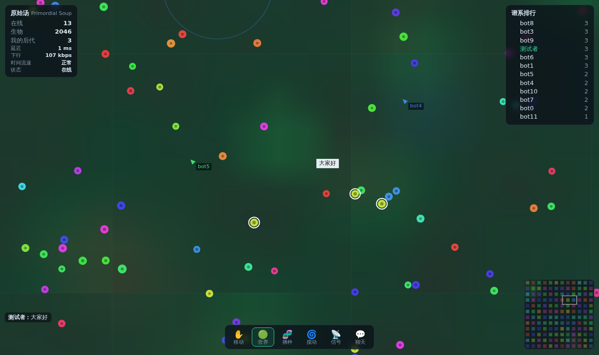

# evo-multiplayer · 二维物理生物化学演化游戏的公网多人底座

让**任意数量的人**通过浏览器同时进入同一个二维生命演化世界并互相影响：投放营养、播种自己的谱系、搅动水流、释放信号素、看到彼此的光标和聊天。
服务端是权威模拟（防作弊、结果一致），世界切成区块由多个分片进程并行模拟，前面一层网关把快照扇出给所有玩家——人数上来就加网关，世界算不动就加分片。



自带一个可玩的演示游戏“原始汤”（`src/game/soup.js`）：光照驱动营养再生、代谢产生废物、信号素扩散；每个生物有一个小神经网络，分裂时基因突变，颜色随基因漂移，谱系会自然分化。**它只是一个可替换的模块**，你自己的游戏按 [docs/game-interface.md](docs/game-interface.md) 实现同样的几个函数就能直接跑在这套网络层上。

## 30 秒跑起来

需要 Node.js 22.5 或更新版本（单机账号数据库用的是 Node 自带的 SQLite）。

```bash
cd evo-multiplayer
npm install
npm start                     # 默认：CPU 数自动决定分片/网关数量，端口 8080
# 打开 http://localhost:8080
```

常用参数：`node src/launch.js --shards 4 --gateways 2 --port 8080 --world 24x24`

**账号、交易、聊天交友**：注册/登录（两步验证、恢复码）、把自己谱系的生物收进背包、市场买卖、玩家间交易、好友、私信、举报、自动审核和管理员后台都已内置，设计和实测见 [docs/accounts-social.md](docs/accounts-social.md)。单机默认用 SQLite（`data/meta.db`），上线设 `DATABASE_URL=postgres://...`。

**要上 10 万人？** 看 [docs/scale-100k.md](docs/scale-100k.md)：哪里会先撑不住、对应的设计（分区网关、增量地图、人群上限……）、机器配置推算、带宽成本，以及上线前的 10 万机器人分布式压测流程。

## 放到公网（三选一）

| 方式 | 适合 | 命令 |
|---|---|---|
| **Cloudflare 快速隧道**（家里电脑直接公网，不用域名/公网 IP/端口转发） | 朋友试玩，≈200 人以内 | `./scripts/tunnel.sh` → 输出 `https://xxx.trycloudflare.com` |
| **一台 VPS + Docker Compose + Caddy**（自动 HTTPS、多网关负载均衡） | 正式上线，几千人 | `cd deploy && DOMAIN=你的域名 CLUSTER_SECRET=… TOKEN_SECRET=… docker compose up -d --scale gateway=3` |
| **Fly.io 单机** | 不想管服务器 | `fly deploy --config deploy/fly.toml` |

多台机器、上万人的部署方式、安全清单见 [docs/deploy.md](docs/deploy.md)。

## 架构一图

```
 浏览器 ×N ──wss──┐
 浏览器 ×N ──wss──┤   负载均衡(Caddy/Cloudflare/任意 L4/L7，无需粘性会话)
 浏览器 ×N ──wss──┘
        │
   ┌────┴─────┬──────────┐        网关层：只管连接，无状态，可随意加
   │ 网关 A   │ 网关 B   │ …      · 兴趣管理：每个玩家只订阅视野内区块
   └────┬─────┴────┬─────┘        · 同一区块对一个网关只订阅一次（引用计数）
        │  内网 ws  │              · 分片编码好的字节原样转发 + 每人每 tick 合并成 1 条消息
   ┌────┴───┬──────┴──┬────────┐   · 慢客户端：不堆积，从关键帧重新同步
   │ 分片 0 │ 分片 1  │ 分片 2 │ … 分片层：权威模拟，各管一块矩形区块
   └───┬────┴────┬────┴────┬───┘  · 边界实体以“幽灵”只读复制给邻居（碰撞/感知跨缝）
       └── 迁移 + 幽灵 ──┘         · 实体越界 → 连同基因整体迁移给新主人，id 不变
                                   · 过载时整体放慢（时间膨胀），不跳帧不爆炸
```

关键设计（详细见 [docs/architecture.md](docs/architecture.md)）：

1. **编码一次，扇出 N 次**：每个区块每个网络帧只编码一次（关键帧 + 增量），网关原样转发给所有观看者。观众多少不影响分片 CPU。
2. **兴趣管理 + 三级 LOD**：只收视野内区块；放大时 10 Hz，缩小时自动换成 2.5 Hz 的低频流（带宽省 43%），再远就只收全世界低清概览。
3. **“最新者为准”的客户端合并**：区块流之间没有全局顺序（跨分片交接、网关回放缓存），客户端用分片时钟判断谁的信息更新，保证不会丢实体或重影——端到端测试逐个实体对比服务器真值。
4. **热点自动分流**：所有人挤到一个角落时，协调者把过载分片的边界区块实时搬给空闲的邻居（带确认、可重发、不重复），网关和客户端无缝跟随。实测热点从 35ms/tick 降到约 18ms，81 次搬迁 0 失步。
5. **世界不会因为重启而消失**：分片定期快照 + 停止时写最终快照，启动自动恢复；玩家身份密钥也持久化，谱系归属跨重启保留。分片崩溃会被自动拉起，玩家不掉线。
6. **分区网关**：世界切成若干区，每个区一组网关，镜头跨区时客户端先连新区、再断旧连接（画面不中断）。每个网关只接收自己那一块世界，实测内部流量降为 1/3（2×2 区），区越多降得越多。
7. **运维后台 + 管理工具**：`/admin`（设置 `ADMIN_TOKEN` 开启）可以看集群负载、区块归属图、全服聊天，一键禁言、踢出、封禁（可选连 IP）、解除，支持聊天屏蔽词。处罚在所有网关同时生效，重启不丢。
8. **账号、经济、社交**：账号和世界身份打通（游客照样能玩），复式记账 + 幂等键保证钱不会凭空多出或少掉，市场和玩家交易都是单事务原子完成；好友、私信（隐私设置、屏蔽、限速）、服务器取证的举报；聊天自动拦截钓鱼链接和场外交易引流，多次违规自动禁言；版主/管理员分级权限，所有管理操作写审计日志。见 [docs/accounts-social.md](docs/accounts-social.md)。
9. **一切可测**：`npm test` 会启动真实的 4 分片 + 网关，连真实客户端，冻结模拟后逐个核对实体位置。

## 实测（单台 4 核容器，分片/网关/压测机器人都挤在同一台）

| 场景 | 结果 |
|---|---|
| 1 网关 1000 人 | 网关 CPU 37%，出口 37.7 MB/s，RTT p50 1ms / p95 15ms，0 失步 |
| 2 网关 2000 人 | 均分 999/1001，总出口 93 MB/s，RTT p50 ≈10ms / p95 ≈55ms，0 失步 |
| 模拟 | ≈1.3 µs / 生物 / tick（优化后，见 benchmarks.md §9）；实体再多就加分片 |
| Docker Compose 4 分片 + 网关 | 跨容器运行、2×2 分片角落交接，0 失步 |
| 账号/社交层（2 个 meta 副本 + PostgreSQL，1500 个并发账号） | 2898 次调用/秒，p50 13 ms / p99 95 ms，实时推送 5.6 万条 |
| 热点（150 人挤进 4 分片中的一个象限） | 关闭均衡：热点分片 35ms/tick、其余 4–7ms；开启：81 次实时搬区块后四个分片各 15–22ms，0 失步 |

每位玩家下行带宽 ≈ 视野内实体数 × ~25 字节/秒（画面里 450 个生物 ≈ 19 KB/s ≈ 150 kbps）。完整数据和方法见 [docs/benchmarks.md](docs/benchmarks.md)。

## 参考了谁、借鉴了什么

r/place（百万人同画布：差量推送、冷却限速）、EVE Online（时间膨胀）、Screeps（按房间并行处理的 MMO）、SpatialOS / Star Citizen 服务器网格（空间分区 + 权威转移 + 兴趣管理）、Gaffer on Games（快照增量 + 量化）、slither.io / agar.io（WebSocket .io 游戏单服规模）、Colyseus（房间 + 二进制增量）、Network Tierra（数字生物在互联网上迁移演化）。逐条对照见 [docs/references.md](docs/references.md)。

## 目录

```
src/shared/     浏览器和服务器共用：二进制编解码、协议、拓扑、客户端世界副本
src/server/     shard-node.js 分片 · gateway-node.js 网关 · region.js 区块/幽灵/迁移
                coordinator.js 区块归属与负载均衡（运行在 0 号分片）
                snapshot.js 快照编码 · link.js 内部连接 · game-loader.js
                control.js 控制面：玩家名录、聊天记录、禁言/封禁（运行在 0 号分片）
src/meta/       账号/经济/社交服务：meta-node.js（多副本）· store.js（PostgreSQL / SQLite）
                accounts.js · ledger.js 复式账本 · economy.js 市场/交易/收集 · social.js · moderation.js
src/game/       soup.js 演示游戏（替换成你的） · template.js 最小模板
src/launch.js   单机一键启动（多进程）
public/         浏览器客户端（Canvas 2D，支持触屏）· social.js 账号/背包/市场/交易/好友面板 · admin.html 运维后台
bench/          bots.js 压测机器人（同时校验协议一致性）· headless.js 无网络模拟调参 · meta-load.js 账号/社交层压测
test/           单元测试 + 端到端真值对比
deploy/         docker-compose.yml · Caddyfile · fly.toml
scripts/        tunnel.sh 一键公网 · gen-cluster.mjs 生成大规模集群部署 · backup.sh / restore.sh 备份恢复 · bots-fleet.sh 多机压测 · dev-bg.sh / dev-stop.sh
docs/           架构、协议、接入指南、部署、参考、压测
```

## 常用命令

```bash
npm test                                             # 54 个测试：真实网络端到端、实时搬区块、整集群重启、跨网关封禁、跨区切换、账号/交易/社交
TEST_DATABASE_URL=postgres://… npm run test:pg          # 账号/经济测试在 PostgreSQL 上再跑一遍（会清空该库）；GitHub Actions 每次推送自动跑这两项 + Docker 构建
node bench/headless.js --shards 4 --world 16x16      # 不开网络，看生态/性能
node bench/bots.js --url ws://localhost:8080/ws --n 500 --duration 60   # 压测
node bench/meta-load.js --url ws://localhost:8080/ws --clients 500   # 账号/社交层压测（需调高 REGISTER_PER_IP_HOUR、MAX_PER_IP）
node bench/soak.js --url ws://localhost:8080/ws --n 1000 --seconds 180 --admin-token … --db postgres://…   # 1000 个不同行为玩家的混沌测试 + 全量不变量检查（见 benchmarks.md §10）
curl localhost:8080/metrics                          # 网关指标
curl localhost:9100/metrics                          # 分片指标（内网）
```
