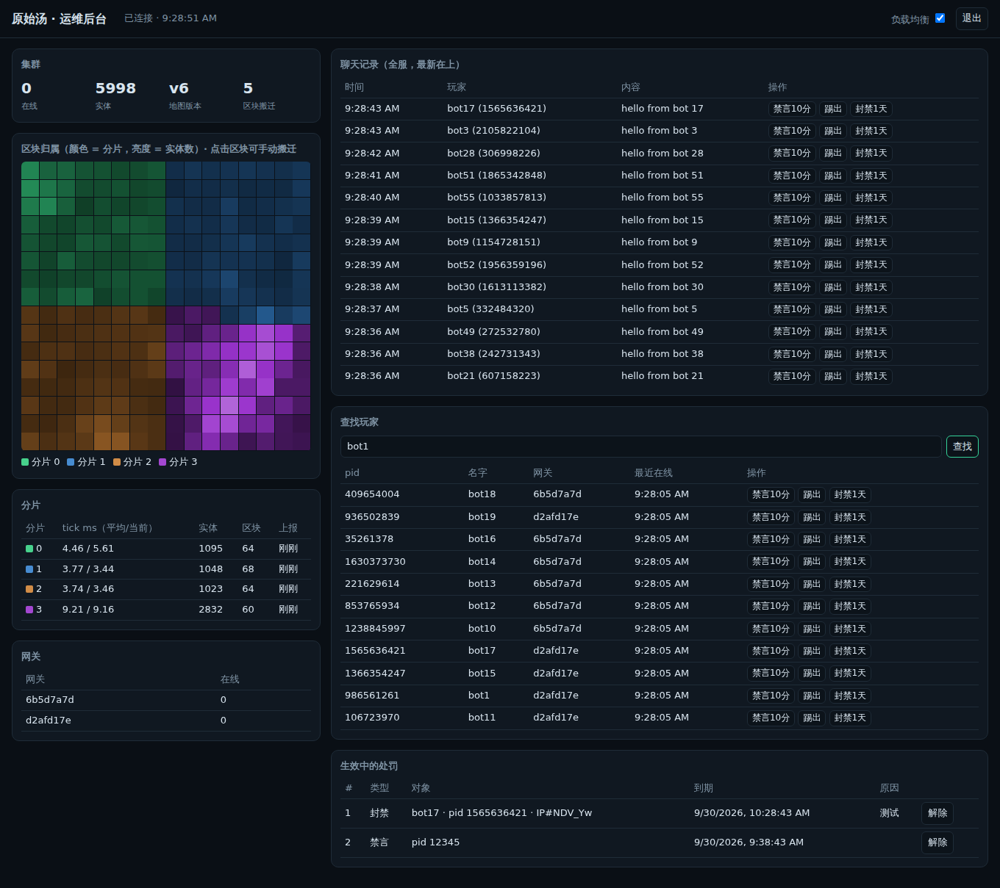

# 部署到公网

按人数从小到大四种方式。它们跑的是同一份代码，只是进程放在哪里不同。

## A. 家里电脑 + Cloudflare 快速隧道（≈200 人以内）

不需要域名、公网 IP、路由器端口转发。

```bash
# 先装 cloudflared：macOS `brew install cloudflared`；Windows `winget install --id Cloudflare.cloudflared`
cd evo-multiplayer
npm install
./scripts/tunnel.sh              # 启动游戏 + 隧道，终端里会打印 https://xxxx.trycloudflare.com
```

把打印出来的地址发给别人即可。限制：Cloudflare 对快速隧道有**同时 200 个在途请求**的硬上限，每条 WebSocket 连接占一个，且没有可用性保证。电脑关机，服务就停。

**超过 200 人**：注册免费 Cloudflare 账号，把域名托管到 Cloudflare，建一个**命名隧道**（没有这个上限）：

```bash
cloudflared tunnel login
cloudflared tunnel create soup
cloudflared tunnel route dns soup soup.你的域名.com
cloudflared tunnel run --url http://localhost:8080 soup
```

启动游戏时加 `TRUST_PROXY=true IP_HEADER=cf-connecting-ip`（`tunnel.sh` 已自动加上），网关才能区分玩家 IP（否则所有人看起来来自 127.0.0.1，会被单 IP 上限挡住）。

## B. 一台 VPS（几千人）

推荐 4–8 核、带宽足（每人约 150–400 kbps，1000 人 ≈ 150–400 Mbps）。

```bash
# 服务器上（Ubuntu），装好 Docker 后：
git clone <你的仓库> && cd <仓库>/evo-multiplayer/deploy
export DOMAIN=soup.你的域名.com                      # 先把域名 A 记录指向这台服务器
export CLUSTER_SECRET=$(openssl rand -hex 16)
export TOKEN_SECRET=$(openssl rand -hex 16)           # 固定下来！换了玩家会丢身份
docker compose up -d --scale gateway=3
```

得到：4 个分片容器（只在内部网络）、3 个网关容器、Caddy 自动申请 HTTPS 证书并把 `wss://` 连接均衡到各网关。打开 `https://soup.你的域名.com`。

调整：
- 加网关：`docker compose up -d --scale gateway=6`（人多、出口 CPU 高时）。
- 加分片：编辑 `docker-compose.yml`，增加 `shardN` 服务，并在 `TOPOLOGY.shards` 数组里加上它的地址，`docker compose up -d`（分片数变了，世界会重新划分，当前是重开世界）。
- 世界大小：改 `TOPOLOGY.world.chunksX/chunksY`。

不用 Docker 也行：单机直接 `PORT=8080 node src/launch.js --shards 4 --gateways 3`，前面放 Caddy/Nginx 反代到 8080（要支持 WebSocket upgrade）。

## C. Fly.io（不想管服务器）

```bash
cd evo-multiplayer
fly launch --config deploy/fly.toml --copy-config --no-deploy
fly secrets set CLUSTER_SECRET=$(openssl rand -hex 16) TOKEN_SECRET=$(openssl rand -hex 16)
fly deploy --config deploy/fly.toml
```

单机里跑多个分片和网关进程（`SHARDS`、`GATEWAYS` 环境变量）。

## D. 多台机器（上万人；10 万人见 [scale-100k.md](scale-100k.md)）

最省事的方式是用生成器产出整套 Compose/Swarm 文件：

```bash
node scripts/gen-cluster.mjs --shards 16 --zones 2x2 --gw-per-zone 2 --world 64x64 --out deploy/generated
```

也可以手动按下面的方式在每台机器上起进程：

每个进程都读同一个 `TOPOLOGY`（JSON）：

```json
{"world":{"chunksX":48,"chunksY":48},
 "shards":["ws://10.0.0.11:9100","ws://10.0.0.12:9100","ws://10.0.0.13:9100","ws://10.0.0.14:9100",
           "ws://10.0.0.15:9100","ws://10.0.0.16:9100","ws://10.0.0.17:9100","ws://10.0.0.18:9100"]}
```

```bash
# 分片机器 i（内网）
TOPOLOGY='…' SHARD_ID=i HOST=0.0.0.0 PORT=9100 CLUSTER_SECRET=… node src/server/shard-node.js
# 网关机器（任意多台，放在负载均衡后面）
TOPOLOGY='…' PORT=8080 CLUSTER_SECRET=… TOKEN_SECRET=… TRUST_PROXY=true node src/server/gateway-node.js
```

- 分片之间、网关到分片之间需要内网互通；分片端口**不要**暴露公网。
- 所有机器开 NTP 时间同步（客户端用分片时钟判断哪条信息更新，偏差几十毫秒内都没问题）。
- 负载均衡器：任何支持 WebSocket 的 L4/L7 均可（云厂商 LB、Caddy、Nginx、HAProxy、Cloudflare）。**不需要粘性会话**。
- 网关可以按地区部署（离玩家近），分片集中在一个机房。

## 环境变量一览

| 变量 | 作用 | 默认 |
|---|---|---|
| `TOPOLOGY` | 世界与分片地址 JSON | 单分片本机 |
| `CLUSTER_SECRET` | 内部连接共享密钥 | 开发值（上线务必改） |
| `TOKEN_SECRET` | 玩家身份 token 签名密钥（固定） | 由 CLUSTER_SECRET 派生 |
| `GAME` | 游戏模块名或路径 | `soup` |
| `PORT` / `HOST` | 监听 | 网关 8080/0.0.0.0，分片 9100+id/127.0.0.1 |
| `SHARD_ID` | 分片编号 | 0 |
| `MAX_PER_IP` | 单 IP 最大连接数 | 16 |
| `MAX_CLIENTS` | 单网关最大连接数 | 20000 |
| `MAX_CHUNKS` / `MAX_CHUNKS_LO` | 高档 / 低档视野最多区块数，超过切到概览 | 30 / 80 |
| `LO_EVERY` | 低档每几个网络帧发一次 | 4（2.5 Hz） |
| `TRUST_PROXY` | 在反代/隧道后面必须开，否则所有人都算作代理的 IP | false |
| `IP_HEADER` | 代理会**覆盖**的真实 IP 头，如 Cloudflare 的 `cf-connecting-ip`；设了就只看它 | 空 |
| `PROXY_HOPS` | 不设 `IP_HEADER` 时，从 `X-Forwarded-For` **右边**数第几个是客户端（= 你前面代理的层数）。左边的条目客户端可以伪造，绝不采用 | 1 |
| `REPLAY_RATE` / `REPLAY_BURST` | 每个客户端追帧重放的字节预算（防止用很小的视口消息刷大流量） | 256KB/s / 2MB |
| `ALLOWED_ORIGINS` | 允许的网页来源（逗号分隔，空 = 不限） | 空 |
| `TICK_HZ` / `NET_EVERY` / `KEY_EVERY` | 模拟频率 / 每几 tick 发一帧 / 每几帧一个关键帧 | 20 / 2 / 30 |
| `FIELD_EVERY` / `FIELD_NET_RES` | 化学场发送间隔(tick) / 发送分辨率 | 20 / 8 |
| `DATA_DIR` | 分片快照目录（空 = 不持久化） | `launch.js`：`./data`；Docker：`/data` |
| `SNAPSHOT_EVERY` | 快照间隔（秒） | 30 |
| `BALANCE` | 动态负载均衡（`false` 关闭，区块归属固定） | true |
| `HOT_MS` / `BALANCE_RATIO` | 分片 tick 耗时超过多少毫秒算热 / 接收方须低于热分片的多少倍 | 30 / 0.7 |
| `ADMIN_TOKEN` | 开启运维后台 `/admin` 和 `/admin/api/*`（不设则关闭）。用长随机串 | 空 |
| `BLOCKLIST` | 聊天屏蔽词文件路径（每行一个，`#` 开头为注释，不区分大小写，替换为 `*`） | 空 |
| `ZONES` / `ZONE` | 分区：`{"cols":4,"rows":4,"urls":["/z/0/ws",…]}`，每个网关用 `ZONE` 指明自己服务哪个区（-1 = 大厅）。用 `scripts/gen-cluster.mjs` 生成，见 scale-100k.md | 不分区 |
| `ACTIONS_PER_CHUNK_TICK` / `CHAT_LOG_PER_SEC` | 每区块每 tick 最多处理多少次工具操作 / 每分片每秒最多抄送多少条聊天给后台 | 20 / 100 |
| `SUMMARY_MAX` | 世界概览最多多少格（每边） | 48 |
| `BOOT_WAIT` | 0 号分片冷启动时最多等其他分片报到多久（毫秒） | 6000 |
| `SHARDS` / `GATEWAYS` / `WORLD` | `launch.js` 单机启动用 | 自动 / 自动 / 24x24 |

## 运维后台与管理

设置 `ADMIN_TOKEN` 后打开 `https://你的域名/admin`，输入口令即可：



- 集群概况、每个分片的负载、区块归属图（颜色 = 分片，亮度 = 实体数）；点击区块可以手动把它搬到别的分片；可以开关自动负载均衡。
- 全服聊天记录（所有分片汇总到 0 号分片，保留最近 500 条），每条都能直接禁言、踢出、封禁。
- 按名字或 pid 查找玩家。
- 生效中的处罚列表，可解除。处罚保存在 0 号分片的 `DATA_DIR/bans.json`，重启不丢，到期自动解除。

处罚的执行：
- **禁言**：该玩家的聊天不再发出，他会收到提示。
- **踢出**：断开连接（关闭码 4001），客户端 10 秒后自动重连。
- **封禁**：断开连接（4003），该身份再也连不上；客户端显示“已被封禁”，不再重连。默认**只封身份**。玩家换个新的匿名身份仍能进，这是匿名游戏的固有限制，要彻底防需要账号体系。
- **封禁 + IP**：连同 IP 一起封，该地址的新连接在握手阶段就被拒绝。慎用：手机网络（运营商级 NAT）、学校、公司的一个 IP 后面可能有很多人。IP 只以带密钥的哈希形式离开网关。

API（都需要 `Authorization: Bearer <ADMIN_TOKEN>`）：`GET /admin/api/state`、`GET /admin/api/players?q=`，以及 `POST /admin/api/{mute,kick,ban,lift,move,balance}`，POST 的参数用 JSON 传，如 `{"pid":123,"minutes":60,"reason":"刷屏","withIp":false}`、`{"id":3}`、`{"chunk":40,"to":2}`、`{"on":false}`。同一 IP 一分钟内口令错 10 次会被暂时拒绝。

## 上线安全清单

- [ ] 设置 `ADMIN_TOKEN`（长随机串），上线后第一时间确认 `/admin` 能用。
- [ ] 设置随机的 `CLUSTER_SECRET`、`TOKEN_SECRET`，并固定 `TOKEN_SECRET`（`launch.js` 未指定时会自动生成并存在 `data/secrets.json`）。
- [ ] 备份 `DATA_DIR`（Docker 里是每个分片的 `shardN_data` 卷）：那就是整个世界。
- [ ] 分片端口只在内网；防火墙只开 80/443。
- [ ] 走 HTTPS/WSS（Caddy/Cloudflare 自动处理）。
- [ ] 在反代后面开 `TRUST_PROXY=true`，并按实际层数设 `PROXY_HOPS`（Caddy/Nginx 一层 = 1），或在 Cloudflare 后面设 `IP_HEADER=cf-connecting-ip`。否则单 IP 限制会误伤或被绕过。
- [ ] 需要时设置 `ALLOWED_ORIGINS=https://你的域名`，防止别的网站嵌入你的服务器。
- [ ] 聊天：已过滤控制字符、限长限速；如需敏感词过滤，在 `gateway-node.js` 的 `onClientJson` 里加。
- [ ] 监控：`/healthz`（存活）、网关与分片的 `/metrics`（JSON，可接 Prometheus 的 json exporter）。
